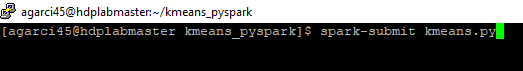
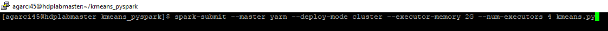
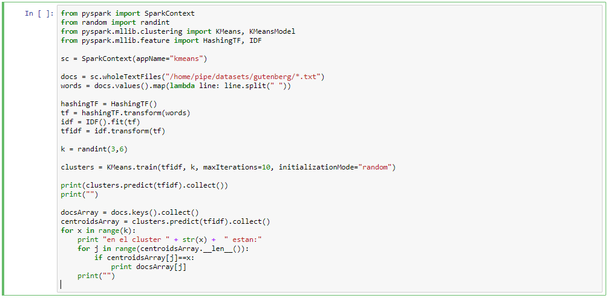
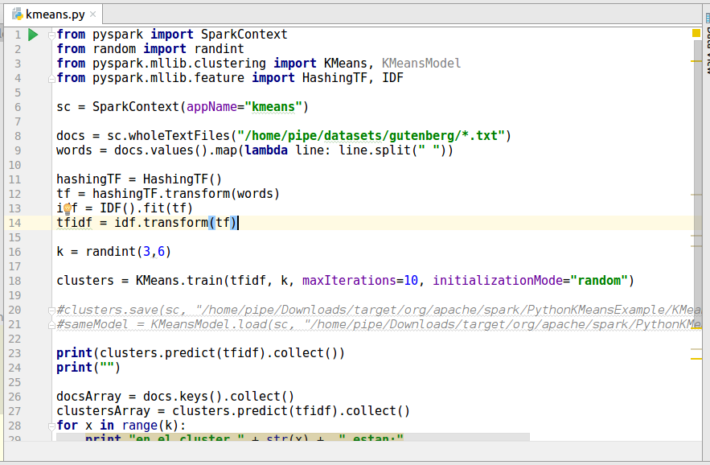
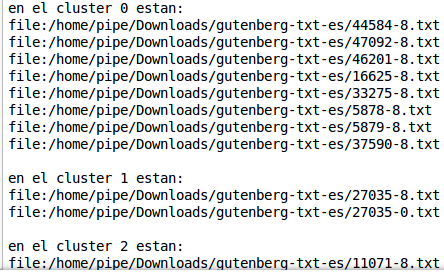

# Clustering basado en Big Data
Tópicos Especiales en Telemática - Proyecto 4

Realizado por:

* Andrés Felipe García Granados
* Cristian David Suaza Cárdenas
* Stiven Andrés Hurtado Loaiza

# Descripción

Algoritmo que permite agrupar documentos similares en un número de *k* clusters. Ésto se realiza utilizando el algoritmo [k-means](https://es.wikipedia.org/wiki/K-means) con la ayuda de [Tf-idf](https://es.wikipedia.org/wiki/Tf-idf) que es una medida para clasificar documentos relacionados entre sí.

# Recursos utilizados

  - Ubuntu 16.04.1
  - PyCharm Edu 4.0.2
  - Python 3
  - Spark 2.1.1
  - Jupyter
  - PuTTY
  - Dataset [gutenberg-txt-es](https://github.com/edwinm67/cursohadoop/blob/master/datasets/gutenberg-txt-es.zip)
  
  # Desarrollo

Por medio de **Tf-idf** se calcula el peso de cada una de las palabras que aparecen en los documentos del dataset, es decir, se omiten las palabras vacías (stop words) y se halla un valor numérico que indica la relevancia de las palabras dentro de los diferentes documentos. Una vez obtenido el resultado que contiene los valores de los pesos de estas palabras, se pasa a la función *k-means* proporcionada por [spark mlib](https://spark.apache.org/docs/2.1.1/mllib-clustering.html), la cual se encarga de agrupar en *k* clusters los documentos más similares entre sí.

# Ejecución

Para ejecutar este algoritmo se puede utilizar un cluster YARN, un notebook de Jupyter, un entorno de desarrollo como Pycharm Edu, entre otras alternativas.

En nuestro caso utilizamos la primera opción:

* Opción 1 - Cluster YARN

Prerrequisitos:

Tener instalado Python 3, Spark, y pyspark para ejecutar por línea de comandos.

Clonar el repositorio y moverse a ese directorio para ejecutar.

Para ejecutar localmente se puede ejecutar con la siguiente instrucción:

Para ejecutar en el cluster se ejecuta con la siguiente instrucción:

* Opción 2 - Jupyter

Crear un notebook con Python 3

Ejecutar el código **kmeans.py** por medio del botón **Run** o con las teclas **shift** + **enter**

* Opción 3 - Pycharm Edu

Abrir el proyecto y ejecutar el archivo **kmeans.py**

**Nota:** Independiente de cualquiera de las opciones utilizadas, la salida siempre deberá ser la misma.

